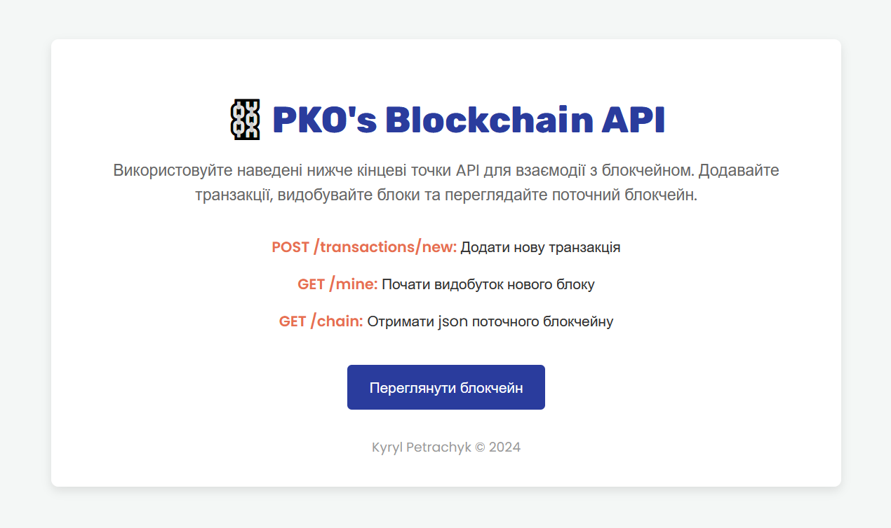

# Blockchain Sketchbook ⛓️


This sketchbook is a collection of small, self-contained experiments exploring blockchain concepts. From a basic blockchain in Java to Python APIs with Flask and simple frontends, each page focuses on a different idea. It’s not perfect – just a space to learn, test, and try things out. Feel free to explore, experiment, & do anything with this sketchbook.


_**Screenshot 1.** Page 4's Landing Page (in Ukrainian)_

---

## Tools & Technologies 🛠️  

This sketchbook experiments with:  
- **Languages**: Java, Python  
- **Frameworks**: Flask (for Python APIs)  
- **Frontend**: HTML, CSS (minimal static pages)  
- **Concepts Explored**:  
   - Blockchain fundamentals (hashing, Proof of Work, Merkle Trees)  
   - API development with Flask  
   - Multi-node communication and consensus algorithms  

## Project Structure 📂 

The sketchbook is organized into pages, each focusing on a different concept or experiment related to blockchain. Here’s the overall structure & a full breakdown for details:

```plaintext
pko-blockchain-sketchbook/
├── page-1-java/                # :: Java blockchain implementation
│   └── src/
│       └── PKO_Blockchain.java     # Basic blockchain logic with block mining in Java
├── page-2-basics/              # :: Basic Python blockchain API
│   ├── main.py                     # Flask API for creating and mining blocks
│   └── templates/              
│       └── index.html              # Page for interacting with the API
├── page-3-enhanced/            # :: Enhanced Python blockchain
│   ├── main.py                     # Flask API with transaction fees and improved logic
│   └── templates/              
│       └── index.html              # Page for interacting with the API
├── page-4-nodes/               # :: Multi-node Python blockchain
│   ├── main.py                     # Flask API with networking and consensus features
│   └── templates/              
│       └── index.html              # Page for managing nodes and exploring consensus
├── requirements.txt            # Python dependencies for all Flask-based APIs
└── README.md                   # Documentation (you’re here! :D)
```

---

## Getting Started 🛠️  

Each _page_ in this sketchbook is self-contained and focuses on different blockchain experiments. Follow these steps to set up everything for yourself locally:

### **Page 1:** Java Blockchain Basics  
**File**: `PKO_Blockchain.java`  
- A simple blockchain implementation in Java.  
- Features a basic block structure with a genesis block.  
- Implements Proof of Work with a custom hash target.  
- Allows chaining and mining of blocks with timestamped data.  

**How to Run**:  
- Open `PKO_Blockchain.java` in your favorite IDE that supports Java.  
- Run the `main` method to start mining and view the blockchain in the console.  

### **Page 2:** Python Blockchain with Flask  
**Files**:  
- **`main.py`**: A Python-based blockchain with a Flask API.  
  - Supports basic transactions and block mining.  
  - Implements a Merkle Tree for transaction integrity.  
- **`index.html`**: A minimal frontend for interacting with the API.  

**How to Run**:  
```bash
pip install -r requirements.txt
cd page-2
python main.py
```
- Access the API at your localhost address, e.g. `http://127.0.0.1:5000`.  
- Open `index.html` in your browser for a basic UI, or use Postman/cURL for API testing.

### **Page 3:** Enhanced Python Blockchain  
**Files**:  
- **`main.py`**: An upgraded version of the blockchain API.  
  - Adds transaction fees and mining rewards.  
  - Includes improved blockchain validation logic.  
- **`index.html`**: A more user-friendly frontend for exploring the API.  

**How to Run**:  
```bash
pip install -r requirements.txt
cd page-3
python main.py
```
- Access the API at `http://127.0.0.1:5000`.  
- Open `index.html` in your browser to interact with the enhanced features.  

### **Page 4:** Decentralization Experiment  
**Files**:  
- **`main.py`**: A multi-node Python blockchain for experimenting with decentralization.  
  - Allows node registration to simulate a distributed network.  
  - Implements basic consensus and conflict resolution.  
- **`index.html`**: A frontend for managing nodes and resolving conflicts.  

**How to Run**:  
```bash
pip install -r requirements.txt
cd page-4
python main.py
```
- Access the API at `http://127.0.0.1:5000`.  
- Open `index.html` in your browser to manage nodes visually and test consensus.

---

## Known Issues 👾 

Since this is a sketchbook, some things are half-baked, experimental, or just plain broken. Here’s a list of known issues:

### General  
- **Local Only**: The blockchain runs locally with no real decentralization or peer-to-peer networking.  
- **Minimal Validation**: Inputs aren’t rigorously checked, which could lead to unexpected errors or crashes.  

### Java Blockchain  
- **Hardcoded Mining Rules**: The mining process is fixed to find hashes ending in "04," which isn’t practical or configurable.  
- **No Transaction Support**: This implementation focuses only on basic block creation and chaining.  

### Python Blockchain API  
- **Static Frontend**: The provided HTML pages don’t display real-time blockchain data. All interactions must happen through the backend.  
- **No Automated Tests**: There’s no formal testing setup, so all testing must be done manually.  

### Nodes and Networking (Python, page-4's `main.py`)  
- **Basic Consensus**: The conflict resolution mechanism is functional but untested in large or adversarial networks.  
- **No Persistence**: Data isn’t stored persistently, meaning all blockchain data is lost when the server restarts.  

### Performance  
- **Slow Mining**: The Proof of Work algorithm is rudimentary and resource-heavy, making block creation slow.  
- **Limited Scalability**: The blockchain is not optimized for handling a high number of transactions or large datasets.  

## What Else to Explore ⏩

This sketchbook is far from complete, and there are plenty of directions to take it further. So, these are just starting points – there’s no limit to what you can try. Use this sketchbook to test out any of your ideas. Here are some horizons to work on or experiment with:  

- **Add Persistence**: Implement a storage mechanism so the blockchain and transactions aren’t lost when the server restarts.  
- **Improve the Frontend**: Make the HTML pages dynamic to display real-time blockchain data and interactions.  
- **Optimize Mining**: Explore more efficient Proof of Work algorithms or experiment with alternative consensus mechanisms like Proof of Stake.  
- **Implement Transactions in Java**: Extend the Java blockchain to support transactions and a mempool.  
- **Test Scalability**: Simulate high transaction volumes and identify bottlenecks in performance.  
- **Build Multi-Node Networking**: Enable real peer-to-peer communication between nodes to create a distributed blockchain.  
- **Refine Consensus**: Improve the conflict resolution logic to handle more complex scenarios or adversarial nodes.  
- **Automate Testing**: Add unit tests for blockchain integrity, transaction handling, and network consensus.  

## Contributing 🤝

1. Fork this repository.
2. Create a feature branch (`git checkout -b feature/amazing-feature`).
3. Commit your changes (`git commit -m 'Add some amazing feature'`).
4. Push to the branch (`git push origin feature/amazing-feature`).
5. Open a Pull Request.